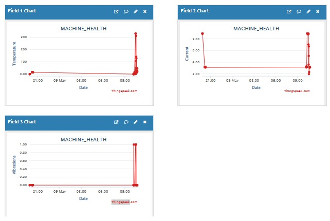
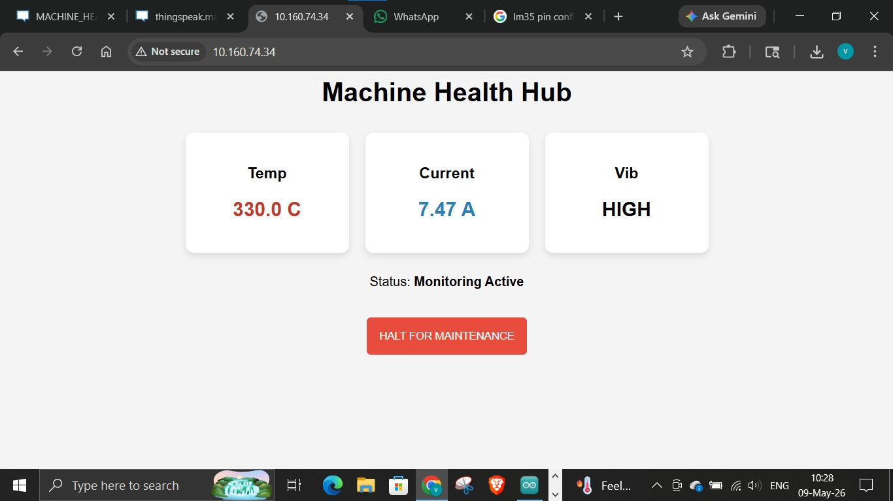

# 🏭 Industrial Machine Health Monitoring System using ESP32 & IoT

<p align="left">
  
  
  
</p>

[](https://varunvamin.github.io/Industrial-Machine-Health-Monitoring/)

## 📝 Overview
This project implements an IoT-based industrial machine monitoring system using an ESP32 microcontroller. It continuously monitors the health of industrial machinery using multiple sensors (temperature, current, and vibration) and provides real-time data visualization through a local web dashboard **and the ThingSpeak cloud platform**. A simulated live demo of the web interface is available to view via GitHub Pages.

## ✨ Key Features
* **Real-time Monitoring:** Collects data from temperature (LM35), current (ACS712), and vibration (SW-420) sensors.
* **Cloud Integration:** Sends telemetry data to ThingSpeak every 20 seconds for historical tracking and remote visualization.
* **Local Web Dashboard:** Hosts a responsive web interface directly on the ESP32 to view live sensor readings on the local network.
* **Maintenance Mode:** Includes a manual "QC Mode" that pauses sensor readings and alerts during maintenance or quality checks.
* **Threshold Alerts:** Generates hardware alerts (via status LED) when the temperature exceeds safe operational limits (30°C).

## 🧰 Hardware Components
* **Microcontroller:** ESP32 Development Board
* **Temperature Sensor:** LM35 (Analog)
* **Current Sensor:** ACS712 (5A module)
* **Vibration Sensor:** SW-420
* **Status Indicator:** LED

## 🔌 Pin Configuration
| Component | ESP32 Pin |
| :--- | :--- |
| Vibration Sensor (SW-420) | GPIO 18 (Digital Input) |
| Temperature Sensor (LM35) | GPIO 34 (Analog Input) |
| Current Sensor (ACS712) | GPIO 35 (Analog Input) |
| Status LED | GPIO 2 (Digital Output) |

## 💻 Software & Libraries
* **Arduino IDE** (Environment for compiling and uploading)
* **WiFi.h** (ESP32 standard library for network connectivity)
* **WebServer.h** (For hosting the local dashboard)
* **ThingSpeak.h** (Official library for ThingSpeak cloud integration)

## ⚙️ Setup Instructions
1. Clone or download this repository.
2. Open `Ins_Health.ino` in the Arduino IDE.
3. Install the required libraries (`ThingSpeak` via the Library Manager).
4. Update the Wi-Fi credentials to match your local network:
   ```cpp
   const char* ssid = "YOUR_WIFI_SSID";
   const char* password = "YOUR_WIFI_PASSWORD";
   ```
5. Update your ThingSpeak Channel Details:
   ```cpp
   unsigned long myChannelNumber = YOUR_CHANNEL_ID; 
   const char* myWriteAPIKey = "YOUR_WRITE_API_KEY";
   ```
6. Select your ESP32 board model and COM port in Arduino IDE.
7. Compile and Upload the code.
8. Open the Serial Monitor (115200 baud) to find the local IP address of the dashboard.
9. Enter the IP address in your web browser to view the real-time hub.

## 📊 Dashboard Preview
To see what the web interface looks like without needing the hardware, check out the **[Live UI Simulation](https://varunvamin.github.io/Industrial-Machine-Health-Monitoring/)** hosted on GitHub pages!

### ThingSpeak Cloud Integration


### Local Web Dashboard


## 📝 License
This project is open-source and available under the [MIT License](LICENSE).